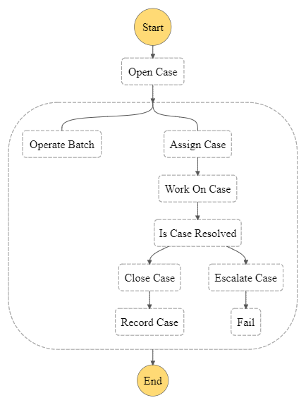

# AWS Integration: Step Function, Lambda, Batch, DynamoDB
An AWS Step Function workflow consists of Lambda Functions, Batch jobs, and DynamoDB operations.

## Author 
- Jeffrey Wang (jeffrey.wanggg@gmail.com)